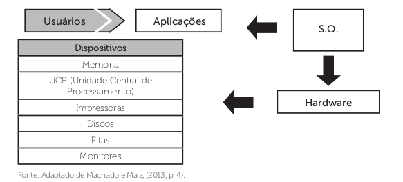
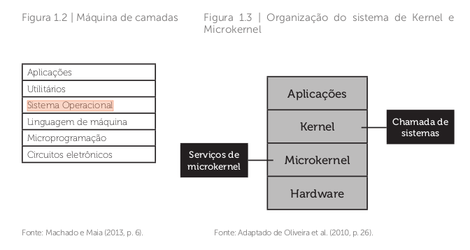

# Sistema Operacional

Machado e Maia (2013, p. 3) definem um sistema operacional como: “[...] um conjunto de rotinas executado pelo processador, de forma semelhante aos programas dos usuários. Sua principal função é controlar o funcionamento de um computador, gerenciando a utilização e o compartilhamento dos seus diversos recursos, como processadores, memórias e dispositivos de entrada
e saída”. Os sistemas operacionais têm basicamente duas funções:

- Facilitar o acesso a recursos do sistema (Intermediário ou interface entre o usuário e o software).

- Organizar o compartilhamento de recursos de forma a garantir a sua proteção (Gerenciador de recursos).

“Cabe, então, ao sistema operacional servir de interface entre os usuários
e os recursos disponíveis no sistema computacional, tornando esta
comunicação transparente, além de permitir um trabalho mais eficiente e
com menores chances de erros” (MACHADO; MAIA, 2013, p. 4).

Se analisarmos as funcionalidades, é possível dizer que os sistemas operacionais trabalham em camadas para a realização de suas tarefas: os usuários interagem com as aplicações, que interagem com o sistema operacional; esse, por sua vez, se comunica com os dispositivos de hardware.

A maioria dos computadores tem dois níveis de operação: modo núcleo e modo usuário. O sistema operacional é a peça mais basica de software e opera em **modo núcleo, também chamado de modo Kernel**. Nesse modo ele tem acesso completo a todo o hardware e pode executar qualquer instrução que a máquina seja capaz de executar. O resto do software opera em **modo usuário**, no qual apenas um subconjunto de instruções da máquina está disponível. Em particular, aquelas instruções que afetam o controle da máquina ou realizam E/S (Entrada/Saída).

O programa de interface com o usuário, shell ou GUI, é o nível mais inferior do software de modo usuário e permite que este inicie outros programas, como o navegador Web, leitor de e-mail ou reprodutor de música. 

O programa do sistema operacional responsável por essa tarefa é o interpretador de comandos (OLIVEIRA et al., 2010). Assim que o usuário inicia sua sessão de trabalho, o interpretador recebe esses comandos e faz uma chamada de sistema, sendo o núcleo do sistema operacional, também chamado de Kernel.

Ele é composto por um processador, memória, sistema de arquivos e é também responsável pela gerência dos dispositivos de entrada e saída.

## Tipos de SOs
Classificação quanto ao compartilhamento de HW

1) Sistemas Operacionais Monoprogramados ou Monotarefa: Um único programa. Só permitem um programa ativo em um dado período, o qual permanece na RAM até seu fim (Ex.: MS-DOS).

- Caracterizam-se por permitir que o processador, a memória e os periféricos permaneçam exclusivamente dedicados à execução de um único programa.

- Recursos são mal utilizados, entretanto, são implementados com facilidade.

- Pode-se pensar que o processo estará em um destes três estados: Nova, Executando e Terminada.

2) Sistemas Operacionais Multiprogramados ou Multitarefa: Mantêm mais de um programa na memória, para permitir o compartilhamento do tempo de CPU e demais recursos (Ex.: UNIX, Windows).

- A ideia é manter vários programas em memória ao mesmo tempo.

- Há várias tarefas simultâneas, em um único processador: enquanto um espera, a outra roda.

- Demandam mecanismo de trocas rápidas de processos.

## Estrutura de SOs
SOs são normalmente grandes e complexas coleções de rotinas de softwares. Projetistas devem dar grande ênfase à sua organização interna e estrutura:

1) Monolítica

- SO é um único módulo

- Consiste em um conjunto de programas que executam sobre o hardware, como se fosse um único programa.

- Opera em modo núcleo, com acesso a todos os recursos do hardware e sem restrições de acesso à memória.

- MS-DOS, Windows, Unix e Linux

2) Micronúcleo (Microkernel)

- Busca tornar o núcleo do SO o menor possível

- A principal função do núcleo é gerenciar a comunicação entre esses processos.

- Núcleo fornece serviços de alocação de CPU e comunicação aos processos (IPC).

- Minix, Symbian

3) Camadas

- A ideia é criar um SO modular com características hierárquicas.

- Modular: divisão de um programa complexo em módulos de menor complexidade.

- Hierárquico: a cada nível, os detalhes de operação dos níveis inferiores podem ser ignorados.

- As interfaces são definidas para facilitar a interação entre os módulos hierárquicos.

- A camada mais baixa realiza a interface com o hardware, enquanto
as camadas intermediárias proveem níveis de abstração e gerência cada vez mais sofisticados. Por fim, a camada superior define a interface do núcleo para as aplicações (as chamadas de sistema). As camadas têm níveis de privilégio decrescentes: a camada inferior tem acesso total ao hardware, enquanto a superior tem acesso bem mais restrito.

- MULTICS, OpenVMS

4) Máquina Virtual

- Essa estrutura cria um nível intermediário entre o hardware e o SO, denominado Gerência de VM.

- Esse nível cria diversas VMs indepedentes.

